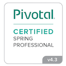

# Marc Koch

_Software developer based in Munich, Germany_

[Email](mailto:marckoch@posteo.de) / [Twitter](https://twitter.com/marckoch1975) / [Xing](https://www.xing.com/profile/Marc_Koch35/cv) / [Linkedin](https://www.linkedin.com/in/marc-koch-159917209/) / [Project Euler](https://projecteuler.net/progress=marckoch75) / [codewars](https://www.codewars.com/users/marckoch) / [credly](https://www.credly.com/users/marc-koch/badges) / [Hackerrank](https://www.hackerrank.com/marckoch) / [github](https://github.com/marckoch)

## employments

|time|company|
|----|---|
|11/2017 - today|Senior Technical Consultant bbv Software Services GmbH, Munich|
|02/2002 - 09/2017|Software Developer JavaEE Sulzer GmbH, Munich|
|03/2000 - 01/2002|Software Developer C++ ELAXY, Puchheim|

## strong knowledge in

Java SE, Java EE, Spring, SpringBoot, Software architecture, Cloud native applications, 12 factor apps, Microservices, Software refactoring, Software quality, Clean Code, CI/CD, SQL

## good knowledge in

Kubernetes, Docker, Javascript, Typescript, React, Angular, HTML, CSS, TDD, Design Patterns, Domain Driven Design, Openshift

## would love to do more of

Kotlin, Clojure, Functional programming, AWS

## projects

|time|project|
|---|---|
|04/2021 - current|software developer at an insurance company quality insurance by using SonarQube in the CI/CD pipeline **technologies used**: Java 11, OpenShift 4, Jenkins, SonarQube|
|10/2020 - 03/2021|fullstack developer at a telecommunications provider implementing user stories  **technologies used**: Java 8, Spring, SpringBoot, JavaScript, Typescript, React, HTML, CSS, Redis|
|...|...more to come...|

## talks

[Microservices - blessing or curse? (in German)](https://bbv-ch.zoom.us/rec/play/OJOthNgKvmkN7Hv4fMLCet_OM_NuaQ8VfWHzZnH9zqzcJw7sLFfyjqTSARFLu79-WhpAqevJxYmLYswH.o8ZvYyYipPGMZRKQ)

## certifications

_(click images to see badges)_

|time|achivement||
|---|---|---|
|08/2020|AWS Cloud Practitioner||
|07/2020|iSAQB Certified Professional Software Architect Foundation||
|12/2019|Certified Kubernetes Application Developer||
|07/2019|Oracle Certified Professional JavaSE 11 Developer (1Z0 817)||
|01/2019|Docker Certified Associate||
|02/2018|Spring Core 4.3 Professional||
|older|Java 8 Associate (1Z0 808), Java 8 Professional (1Z0 809), Scrum Master, Elastic Search|

## other activity / nerd stuff

## education

|time|place|
|---|---|
|1994 - 2000|University Kassel Physics Diploma|
|1988 - 1994|Goetheschule Kassel Abitur 1,4|
